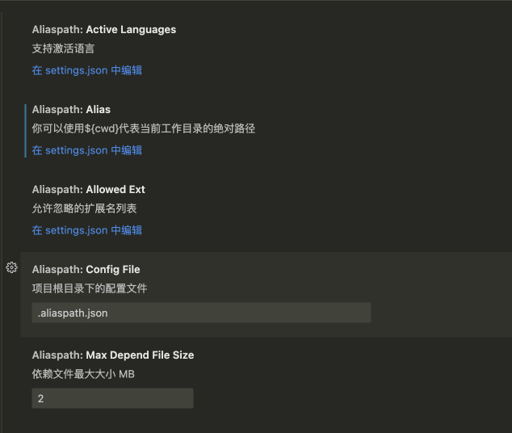

# vscode-alias-path 
[中文](https://github.com/0851/vscode-alias-path/blob/master/README.md)|English

command + left click to jump to the file. Aliases are supported

## setting

```json
{
  "aliaspath.alias": {
    "type": "object",
    "default": {
      "@": "${cwd}/src",
      "~": "${cwd}/src",
      "~~": "${cwd}/newsrc"
    },
    "description": "You can use ${cwd} to represent the absolute path of the current working directory"
  },
  "aliaspath.activeLanguages": {
    "type": [
      "array",
      "object",
      "string"
    ],
    "default": {
      "pattern": "**"
    },
    "description": "Support activation language"
  },
  "aliaspath.configFile": {
    "type": "string",
    "default": ".aliaspath.json",
    "description": "The configuration file in the project root directory"
  },
  "aliaspath.maxDependFileSize": {
    "type": "number",
    "default": 2,
    "description": "Dependent file Maximum size m b"
  },
  "aliaspath.allowedExt": {
    "type": "array",
    "default": [
      "js",
      "ts",
      "tsx",
      "jsx",
      "vue"
    ],
    "description": "A list of extensions that can be ignored"
  }
}
```